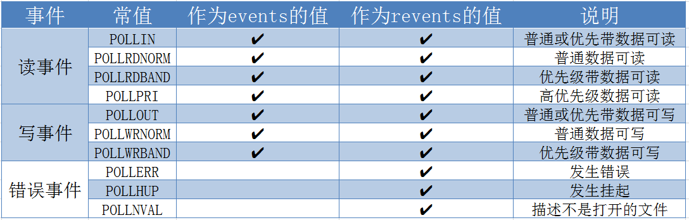

[https://blog.csdn.net/luojian5900339/article/details/54581852](https://blog.csdn.net/luojian5900339/article/details/54581852)

reactor:

[https://www.cnblogs.com/dawen/archive/2011/05/18/2050358.html](https://www.cnblogs.com/dawen/archive/2011/05/18/2050358.html)

[https://www.cnblogs.com/winner-0715/p/8733787.html](https://www.cnblogs.com/winner-0715/p/8733787.html)

## select

---
## poll
- poll管理多个文件描述符，和select一样，采用轮训方式，相对于select没有最大文件描述符限制，但也存在大量文件描述符数组被整体复制于内核态和用户态地址之间.
- 函数原型
```cpp
#include <poll.h>
// fds指向数组结构体第一个元素指针， nfds为数组元素个数，timeout为超时等待时间(毫秒)。
int poll(struct pollfd *fds, nfds_t nfds, int timeout);

// pollfd结构
struct pollfd{
	int fd;			    //文件描述符
	short events;	  //等待的事件
	short revents;	//实际发生的事件（输出）
};
```
- pollfd事件变化



- 超时timeout

  - `-1` ：永远等待直到事件发生
  - `0 `：立即返回
  - `> 0`：等待指定毫秒后返回

- poll返回值
  - 成功时，poll()返回结构体中revents域不为0的文件描述符个数
  - 如果在超时前没有任何事件发生，poll()返回 0
  - 失败时，poll() 返回 -1。

 
 ---
 
 epoll
 
 
