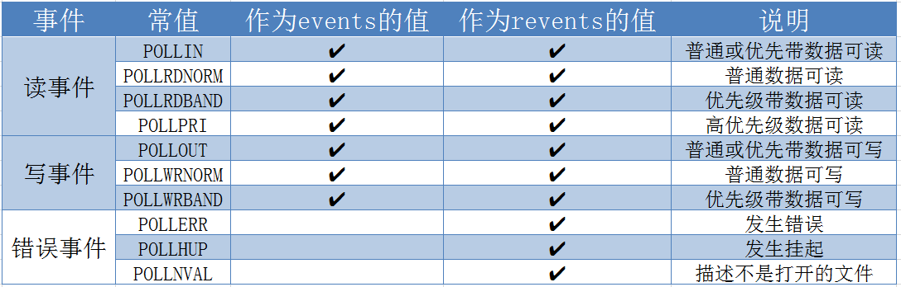

[https://blog.csdn.net/luojian5900339/article/details/54581852](https://blog.csdn.net/luojian5900339/article/details/54581852)

reactor:

[https://www.cnblogs.com/dawen/archive/2011/05/18/2050358.html](https://www.cnblogs.com/dawen/archive/2011/05/18/2050358.html)

[https://www.cnblogs.com/winner-0715/p/8733787.html](https://www.cnblogs.com/winner-0715/p/8733787.html)

## select
监视并等待多个文件描述符的属性变化（可读、可写或错误异常），调用后 select() 函数会阻塞，直到有描述符就绪（有数据可读、可写、或者有错误异常），或者超时（ timeout 指定等待时间），函数才返回。
```cpp
#include <sys/select.h>
#include <sys/time.h>

//返回值：就绪描述符的数目，超时返回0，出错返回-1
//maxfdp1: 表示待测试的描述符个数，取值为被测试描述符最大值+1
//readset/writeset/exceptset: 指定我们要让内核测试读、写和异常条件的描述字集合
//timeout：超时等待时间; 
//	若timeout为NULL，一直等待; timeout中字段为0，立即返回
int select(int maxfdp1, fd_set *readset, fd_set *writeset, fd_set *exceptset, const struct timeval *timeout);

// timeval结构体
struct timeval{
	long tv_sec;   //seconds
	long tv_usec;  //microseconds
};

// fd_set结构体操作函数
void FD_ZERO(fd_set *fdset);           // 清空集合
void FD_SET(int fd, fd_set *fdset);    // 将一个给定的文件描述符加入集合之中
void FD_CLR(int fd, fd_set *fdset);    // 将一个给定的文件描述符从集合中删除
int FD_ISSET(int fd, fd_set *fdset);   // 检查集合中指定的文件描述符是否可以读写 
```

- 优缺点
  - 优点: 同时监听进程中的多个IO状态
  - 缺点
    - 单个进程可监视的fd数量被限制，即能监听端口的大小有限
	- 对socket进行扫描时是线性扫描，即采用轮询的方法，效率较低
	- 需要维护一个用来存放大量fd的数据结构，这样会使得用户空间和内核空间在传递该结构时复制开销大

- 参考代码: [select_service.cpp](./select_service.cpp)  [select_client.cpp](./select_client.cpp)

- 参考： 

[https://www.cnblogs.com/Anker/p/3258674.html](https://www.cnblogs.com/Anker/p/3258674.html)

---
## poll
- poll管理多个文件描述符，和select一样，采用轮训方式，相对于select没有最大文件描述符限制，但也存在大量文件描述符数组被整体复制于内核态和用户态地址之间.
- 函数原型
```cpp
#include <poll.h>
// fds指向数组结构体第一个元素指针， nfds为数组元素个数，timeout为超时等待时间(毫秒)。
int poll(struct pollfd *fds, nfds_t nfds, int timeout);

// pollfd结构
struct pollfd{
	int fd;			    //文件描述符
	short events;	  //等待的事件
	short revents;	//实际发生的事件（输出）
};
```
- pollfd事件变化



- 超时timeout

  - `-1` ：永远等待直到事件发生
  - `0 `：立即返回
  - `> 0`：等待指定毫秒后返回

- poll返回值
  - 成功时，poll()返回结构体中revents域不为0的文件描述符个数
  - 如果在超时前没有任何事件发生，poll()返回 0
  - 失败时，poll() 返回 -1。

 - 参考
 [https://blog.csdn.net/lianghe_work/article/details/46534029](https://blog.csdn.net/lianghe_work/article/details/46534029)
 
 ---
 
 ## epoll
 
 
 ---
 
 ## 参考：
 
 [https://www.cnblogs.com/aspirant/p/9166944.html](https://www.cnblogs.com/aspirant/p/9166944.html)
 	
 
