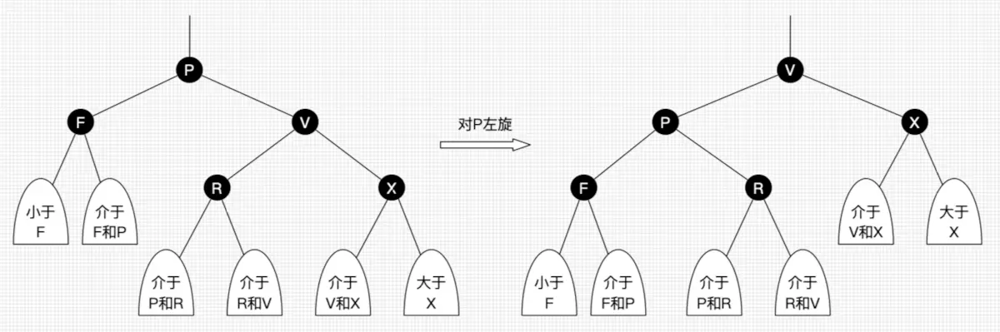

### 性质
1. 每个节点要么是黑色，要么是白色
2. 根节点是黑色
3. 每个叶子节点是黑色
4. 每个红色结点的子节点一定都是黑色
5. 任意一个结点到每个叶子结点的路径都包括数量相同的黑结点。
   

### 作用

### 自平衡调整

1. 左旋
以某个节点为支点，其右子节点变为旋转节点的父节点，右子节点的左子节点变为旋转支点的右子节点，左子节点结构不变。

2. 右旋
以某个节点为支点，其左子节点变为旋转节点的父节点，左子节点的右子节点变为旋转支点的左子节点，右子节点结构不变。

3. 变色

---
### 红黑树查找
因为红黑树是平衡二叉树，所有查找的最坏情况为`log2``n`  

### 插入
1. 找到插入位置
2. 插入后进行旋转和变色调整

### 删除
1. 查找删除
2. 自平衡调整
